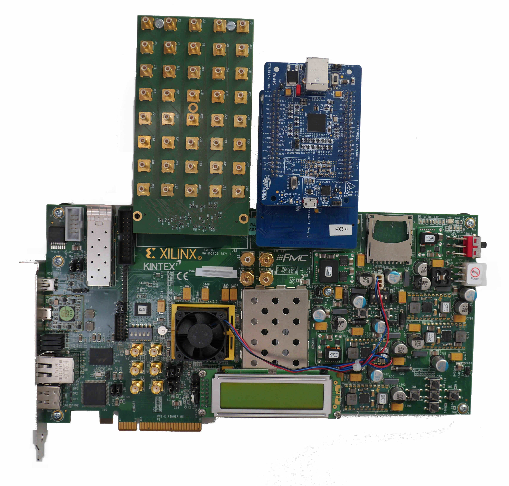
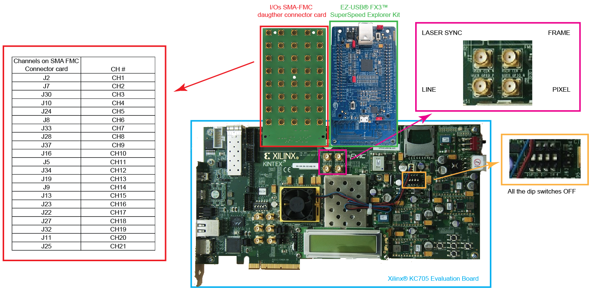
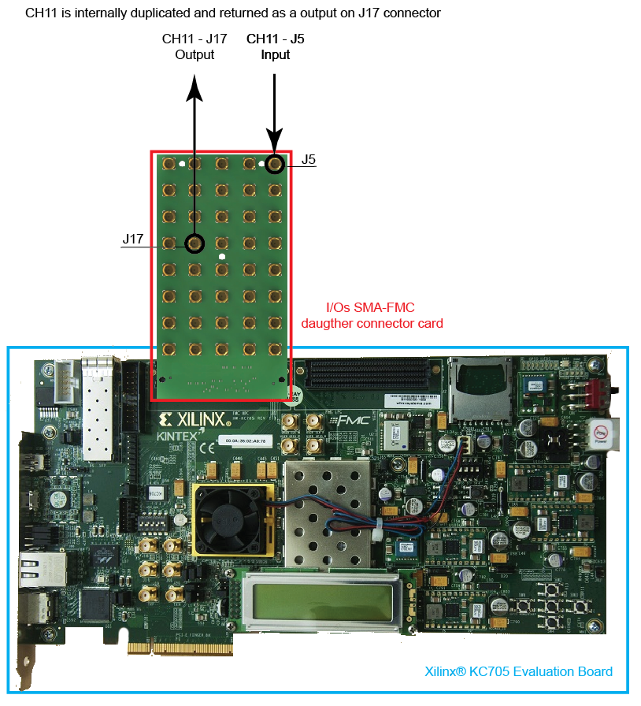

 # **BrightEyes-TTM: Open-access time tagging module**

The BrightEyes-TTM project [[1]](https://doi.org/10.1101/2021.10.11.463950
) born as an offshoot of the BrighEyes project founded by the ERC in 2018 ([Consolidator Grant, N. 818699](https://vicidominilab.github.io/brighteyes/)). The principal aim of the BrightEyes-TTM project is to give to any microscopy laboratory the possibility to implement and further develop single-photon microscopy. The second aim is to trigger the interest of the microscopy community, and establish the BrigthEyes-TTM as a new standard for single-photon laser scanning microscopy (LSM) experiments. 

The BrightEyes-TTM mainly consists in a data-acquisition (DAQ) card able to implement the so-called photon time-tagging acquisition mode (Fig. 1). 

<figure>
<div align="center">
   </br> 
  <figcaption>Fig. 1 - Time-tagging principle. </figcaption> </br> </br> 
</div>  
</figure>

The time-tagging (TT) mode allows recording individual events and labelling each of them with a temporal signature. Typically this temporal signature denotes the delay time of the events in respect to the beginning of the experiment (absolute time). The BrightEyes TT module (TTM) is able to tag three different class of events: The photon events, i.e., a photon is registered by the detector which delivery a digital signal to the module; The sync laser events, i.e., the synchronisation signal delivered by a pulsed laser; the reference events, i.e., a signal generated by another component of the experimental setup (e.g., an actuator, a laser modulator). Starting from these temporal signatures it is possible to derive many other different temporal information. For example, for each photons event it is possible to derive the so-called start-stop time, which describe the delay of the photon event in respect to the successive sync laser event. Very important, together with the temporal signatures, the BrightEyes-TTM records also the number of the channels (<em>ch</em>) or inputs (<em>l</em>) associated to the photon or reference event. In the single-photon laser microscopy applications of our BrightEyes-TTM, the channel for the photon event describes the element of the single-phton-avalanche diode (SPAD) array detector which collected the photon, thus it can be considered a spatial signature.

The BrightEyes-TTM is based on a [field-programmable-gate-array](https://en.wikipedia.org/wiki/Field-programmable_gate_array) (FPGA), which allows implementing a series of [time-to-digital converters (TDCs)](https://en.wikipedia.org/wiki/Time-to-digital_converter), i.e., the building block of the TTM. Current BrightEyes-TTM implementation allows to temporally tag single-photon events with respect to the laser sync (i.e., the start-stop time) - with 30 ps precision - and the reference events (such as pixel, line and frame signals) - with 4.2 ns precision. Because the BrightEyes-TTM is a [VHDL](https://en.wikipedia.org/wiki/VHDL)/[Verilog](https://en.wikipedia.org/wiki/Verilog)-based open-access project, it can be upgraded, modified, and customized by all the microscopy-makers.

The TTM can transfer data to a personal computer (PC) via USB 3.0 cable and can be connected to a fluorescence LSM setup, as a passive plug-n-play device, thanks to a custom interfacing connector board. As shown in the data processing examples below, the BrightEyes-TTM allows for fluorescence spectroscopy, fluorescence lifetime imaging microscopy (FLIM) [2], and for fluorescence lifetime correlation spectroscopy (FLFS) experiments [3]. More in general, the TTM can be used to fully explore the great momentum in the development of new bi-dimensional or one-dimensional asyncronous read-out SPAD array detectors [3,4].
<br>

<figure>
<div align="center">
    </br> 
  <figcaption>Fig. 1 - BrightEyes-TTM </figcaption> </br> </br> 
</div>  
</figure>

**In this repository you can find everything you need to build and further modify the BrightEyes-TTM in your lab.**

The BrightEyes-TTM is composed by three main parts: the FPGA evaluation board ([Xilinx® KC705 Evaluation board](https://www.xilinx.com/products/boards-and-kits/ek-k7-kc705-g.html)); the FX3 data transmission chip ([EZ-USB® FX3™ SuperSpeed Explorer Kit](https://www.cypress.com/documentation/development-kitsboards/cyusb3kit-003-ez-usb-fx3-superspeed-explorer-kit) and [FMC Interconnect Board for the EZ-USB® FX3™ SuperSpeed Explorer Kit](https://www.cypress.com/documentation/development-kitsboards/cyusb3acc-005-fmc-interconnect-board-ez-usb-fx3-superspeed)); a custom-made I/Os SMA-FMC daugther connector card. The three part need to be assembled (Fig. 2) following the instruction below (expand the Assembly Instuctions). Both the FX3 data transmission chip and the I/Os FMC daugther card easily interlock to the main Xilinx® FPGA board. 

<figure>
<div align="center">
   </br> 
  <figcaption>Fig. 2 - BrightEyes-TTM assembly </figcaption> </br> </br> 
</div>  
</figure>

<details><summary>Assembly Instructions</summary>

The Xilinx® KC705 Evaluation board, the Cypress® FX3™ SuperSpeed Explorer Kit and the connector card can be easily stacked together, using FMC connectors, as shown below (Fig. 3). I/Os connections are also labeled for a more intuitive assembly and mapped in the [I/O pins table](boards/IOconnectorBoard/README.md) which shows the correspondence between inputs (typically the digital output from the SPAD array detector elements, named photon chaneels) and the connection pins. For a correct use of the BrightEyes-TTM the [dip switches](https://en.wikipedia.org/wiki/DIP_switch) in the orgage BOX (always Fig.3) should be all set to the OFF position.

The Cypress® FX3™ SuperSpeed Explorer Kit board interlock into the FMC-LPC connector block. While the I/Os connector cards is connected to the FMC-HPC connector. 


<figure>
   </br> 
  <figcaption>Fig.3 - BrightEyes-TTM detailed assembly</figcaption> </br> </br> 
</figure>


In the current application CH11 on J5 input connector board is internally duplicated and sampled with a 400MHz clock and returned as output on pin J17. This feature allow to monitor CH11 activity and content while it is still connected and used into the TTM design (Fig.4).

<figure>
   </br> 
  <figcaption>Fig.4 - CH11 duplication pin map</figcaption> </br> </br> 
</figure>


</details>

**BrightEyes-TTM specifications**

|  |  |
| ------ | ------ |
| Single shot precision* | 30 ps |
| Time bin width | user defined (default 43 ps) |
| Time range** | not limited by hardware |
| Maximum laser sync rate | 80 MHz |
| Dead time | 1 / 240 MHz = ~ 4.2ns |
| Differential non-linearity | ~ 6 % RMS |


*Gaussan fitting sigma value

**Tested at 200 ns (5 MHz), 100 ns (10 MHz), 50 ns (20 MHz), 25 ns (40 MHz), 12.5 ns (80 MHz) 

**BrightEyes-TTM current implementation specifications**

|  | # |
| ------ | ------ |
| Input channels with 30 ps precision | 21 |
| Input channels with < 4.2 ns precision | 3 |
| Laser sync channels | 1 |

# Hardware list

In the table below you can find the complete list of all the needed hardware components for builing the BrightEyes-TTM.

| Name | Product code | Brand | Description | Where to get |
| ------ | ------ | ------ | ------ | ------ |
| Xilinx® KC705 Evaluation Board | EK-K7-KC705-G | Xilinx® | [Kintex-7 evaluation board for the BrightEyes-TTM](boards/FPGAboard) | https://www.xilinx.com/products/boards-and-kits/ek-k7-kc705-g.html |
| EZ-USB® FX3™ SuperSpeed Explorer Kit | CYUSB3KIT-003 EZ-USB | Cypress® | [USB board for data transmission from the FPGA to a host-PC](boards/USB3.0) | https://www.cypress.com/documentation/development-kitsboards/cyusb3kit-003-ez-usb-fx3-superspeed-explorer-kit |
| FMC Interconnect Board for the EZ-USB® FX3™ SuperSpeed Explorer Kit | CYUSB3ACC-005 | Cypress® | [FMC adapter connector card to interconnect a Xilinx® FPGA board with the EZ-USB® FX3™ SuperSpeed Explorer Kit](boards/USB3.0/FMCadapter) | https://www.cypress.com/documentation/development-kitsboards/cyusb3acc-005-fmc-interconnect-board-ez-usb-fx3-superspeed |
| I/Os SMA-FMC daugther connector card | custom-built | custom-built | [FMC daugther card to interface the BrightEyes-TTM with external photon-signals](/boards/IOconnectorBoard) | [Gerber_SMA_FMC.zip](boards/IOconnectorBoard/Gerber_SMA_FMC.zip) |


**Optional hardware parts**

| Name | Product code | Brand | Description | Where to get |
| ------ | ------ | ------ | ------ | ------ |
| NIM to TTL converter | MPD NIM 2 TTL | MPD | Signal converter module capable to convert an input NIM pulse to a Low Voltage TTL for triggering the laser sync out and feeding it to the BrightEyes-TTM | http://www.micro-photon-devices.com/Products/Instrumentation/NIM2TTL-Converter |
|8xDigiBuffer | custom-built | custom-built | [I/O multichannel (8x) digital buffer to match the impedance of external reference signals with the input impedance of the Xilinx® KC705 Evaluation kit](boards/8xDigiBuffer) | [8xDigiBuffer_Gerber.zip](boards/8xDigiBuffer/files/DigiBuff8_rev2_GerberFiles.zip) |

**BrightEyes-TTM operation**

| | |
| ------ | ------ |
| PC interface | USB 3.0 SuperSpeed |
| PC requirements | min. 1.5 GHz CPU clock, min. 16 GB RAM memory, SSD hard disk |
| Operating system | Linux (native) / Windows (ported) |

# Operational software list

Softwares tools for the BrightEyes-TTM FPGA programming and data acquisition.

| Name | Description | Where to get |
| ------ | ------ | ------ |
| Vivado Design Suite® | Xilinx® FPGA Programming software environment | https://www.xilinx.com/products/design-tools/vivado.html |
| Python 3 | Python environment to run the analysis softwares  | https://www.python.org/download/releases/3.0/ |
| BrightEyes-TTM custom Python 3 libraries |In order to be able to reconstruct and process the data streamed by the BrightEyes-TTM few python libraries have to be previously installed in the host-processing computer|[dataProcessing](dataProcessing)|
| Data acquisition software (Linux) | The data receiver is a CLI program for reading the data from the TTM through the USB 3.0 and write them to the PC memory. It is program written in C/C++ developed for Linux OS. | [dataReceiver (Linux)](dataReceiver/linux) |
| Data acquisition software (Windows) | Here a version of the data receiver ported to Windows OS. Please note that the Linux version is our reference version for measurments and tests. | [dataReceiverW (Windows)](dataReceiver/windows) |

# Analysis software list

In order to give the user some preliminary tools to process, reconstruct and use the acquired TTM data we developed 3 main examples using Jupyter Notebook and we provide the associated examples dataset on [Zenodo](https://doi.org/10.5281/zenodo.4912656). Explore the [data processing and analysis section](dataProcessing) for further info.

| Name | Description | PDF version |Where to get | Associated example dataset on Zenodo |
| ------ | ------ | ------ | ------ | ------ |
| TSCPC Histogram | Jupyter Notebook example for TCSPC histogram reconstruction | [TCSPC_Histogram_reconstruction.pdf](dataProcessing/pynotebook/PDF/TCSPC_Histogram_reconstruction.pdf) |[TCSPC_Histogram_reconstruction.ipynb](dataProcessing/pynotebook/TCSPC_Histogram_reconstruction.ipynb)| **Fluorescence_Spectroscopy_Dataset_40MHz** [](https://doi.org/10.5281/zenodo.4912656) |
| Imaging | Jupyter Notebook example for intensity images as well as FLIM images reconstruction | [Image_reconstruction.pdf](dataProcessing/pynotebook/PDF/Image_reconstruction.pdf) | [Image_reconstruction.ipynb](dataProcessing/pynotebook/Image_reconstruction.ipynb) | **FLIM_512x512pixels_dwelltime250us_Dataset_40MHz** [](https://doi.org/10.5281/zenodo.4912656) |
| FCS | Jupyter Notebook example for calculating fluorescence correlation curve | [FCS.pdf](dataProcessing/pynotebook/PDF/FCS.pdf) | [FCS.ipynb](dataProcessing/pynotebook/FCS.ipynb) | **FCS_scanfcs_Dataset_40MHz** [](https://doi.org/10.5281/zenodo.4912656) |
| ISM and phasor analysis | Jupyter Notebook example for implementing the pixel reassignment algorithm as well as the phasor plot analysis for FLIM data| [ISM&Phasors.pdf](dataProcessing/pynotebook/PDF/ISM_Decay_Reconstruction_BrightEyes-TTM_v1_opensource.pdf) | [ISM&Phasors.ipynb](dataProcessing/pynotebook/ISM_Decay_Reconstruction_BrightEyes-TTM_v1_opensource.ipynb) | Output 4D (x,y,t,ch) file from  [Image_reconstruction.ipynb](dataProcessing/pynotebook/Image_reconstruction.ipynb) notebook after having processed **FLIM_512x512pixels_dwelltime250us_Dataset_40MHz** [](https://doi.org/10.5281/zenodo.4912656) |

# References
[1] A. Rossetta, E. Slenders, M. Donato, E. Perego, F. Diotalevi, L. Lanzano', S. V. Koho, G. Tortarolo, M. Crepaldi, G. Vicidomini bioRxiv 2021.10.11.463950; doi: https://doi.org/10.1101/2021.10.11.463950


[2] M. Castello, G. Tortarolo, M. Buttafava, T. Deguchi, F. Villa, S. Koho, L. Pesce, M. Oneto, S. Pelicci, L. Lanzanó, P. Bianchini, C. J. R. Sheppard, A. Diaspro, A. Tosi, and G. Vicidomini, A robust and versatile platform for image scanning microscopy enabling super-resolution FLIM, <em> Nat. Methods</em>, 16: 175–178 (2019), [https://doi.org/10.1038/s41592-018-0291-9](https://doi.org/10.1038/s41592-018-0291-9)  

[3] E. Slenders, M. Castello, M. Buttafava, F. Villa, A. Tosi, L. Lanzano, S. V. Koho, and G. Vicidomini, Confocal-based fluorescence fluctuation spectroscopy with a SPAD array detector, <em> Light Sci. Appl.</em>, 10: 31 (2021), [https://doi.org/10.1038/s41377-021-00475-z](https://doi.org/10.1038/s41377-021-00475-z)  

[4] M. Buttafava, F. Villa, M. Castello, G. Tortarolo, E. Conca, M. Sanzaro, S. Piazza, P. Bianchini, A. Diaspro, F. Zappa, G. Vicidomini, and A. Tosi, SPAD-based asynchronous-readout array detectors for image-scanning microscopy, <em> Optica</em>, 7: 755-765 (2020), [https://doi.org/10.1364/OPTICA.391726](https://doi.org/10.1364/OPTICA.391726)  

[5] S. V. Koho, E. Slenders, G. Tortarolo, M. Castello, M. Buttafava, F. Villa, E. Tcarenkova, M. Ameloot, P. Bianchini, C. J. R. Sheppard, A. Diaspro, A. Tosi, and G. Vicidomini, Two-photon image-scanning microscopy with SPAD array and blind image reconstruction, <em> Biomed. Opt. Express</em>,  11(6): 2905-2924 (2020), [https://doi.org/10.1364/BOE.374398](https://doi.org/10.1364/BOE.374398)  

# Team behind the BrightEyes-TTM


##### **Molecular Microscopy & Spectroscopy**, Istituto Italiano di Tecnologia

[Alessandro Rossetta](https://vicidominilab.github.io/team/AR/), [Eli Slenders](https://vicidominilab.github.io/team/ES/), [Mattia Donato](https://vicidominilab.github.io/team/MD/), [Eleonora Perego](https://vicidominilab.github.io/team/EP/), [Sami Koho](https://vicidominilab.github.io/team/SVK/), [Giorgio Tortarolo](https://vicidominilab.github.io/team/GT/)

and [Giuseppe Vicidomini](https://vicidominilab.github.io/team/GV/)

https://vicidominilab.github.io/

<figure>
  </br> </br> 
</figure>


##### **Electronic Design Laboratory**, Istituto Italiano di Tecnologia

[Francesco Diotalevi](https://www.iit.it/people-details/-/people/francesco-diotalevi),  [Marco Crepaldi](https://www.iit.it/people-details/-/people/marco-crepaldi)

<figure>
  </br> </br> 
</figure>


# Copyright

Time-Tagging Module\
Copyright (c) 2021, Molecular Microscopy & Spectroscopy,\
Italian Institute of Technology. All rights reserved.\
\
https://vicidominilab.github.io/

# License

The Time-Tagging Module (TTM) is an aggregation of different parts with different licenses. See details in [LICENSE.md](LICENSE.md) file.  Unless otherwise stated, they are licensed under a CC-BY-NC 4.0, Creative Commons Attribution-NonCommercial 4.0 International License. [](https://creativecommons.org/licenses/by-nc/4.0/)

In addition to the terms of the license, **we ask to acknowledge the use
of the time-tagging module in scientific articles by citing**:

```
The BrightEyes-TTM: an Open-Source Time-Tagging Module for Single-Photon Microscopy
A. Rossetta, E. Slenders, M. Donato, E. Perego, F. Diotalevi, L. Lanzano', S. V. Koho, G. Tortarolo, M.Crepaldi, G. Vicidomini
bioRxiv 2021.10.11.463950; doi: https://doi.org/10.1101/2021.10.11.463950
```


# Contact us

Do you need help to build up your time-tagging module? Do you have comments or questions? Do not hesitate to contact us at giuseppe.vicidomini@iit.it. 
